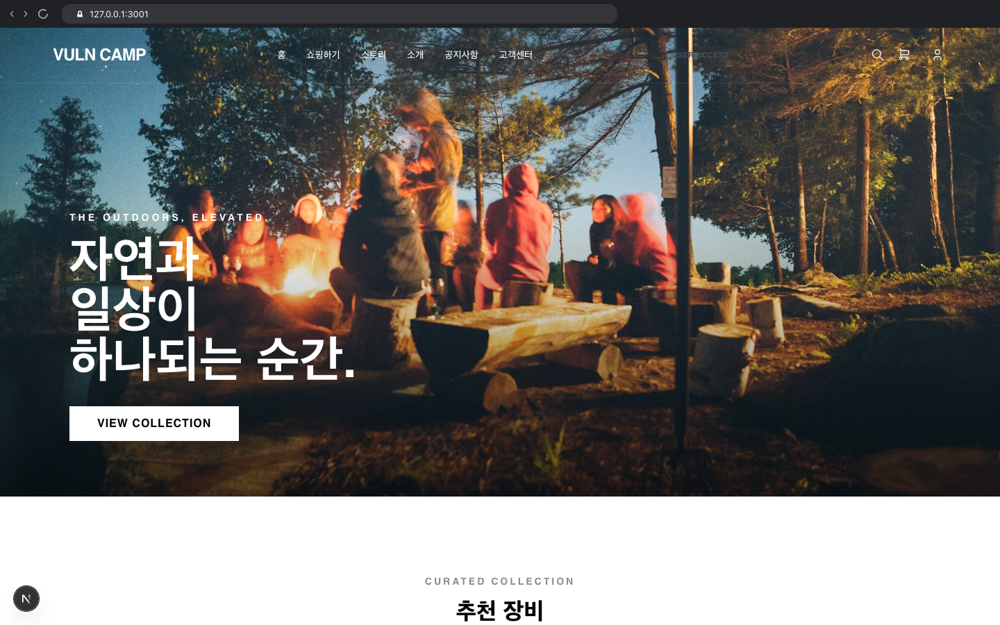
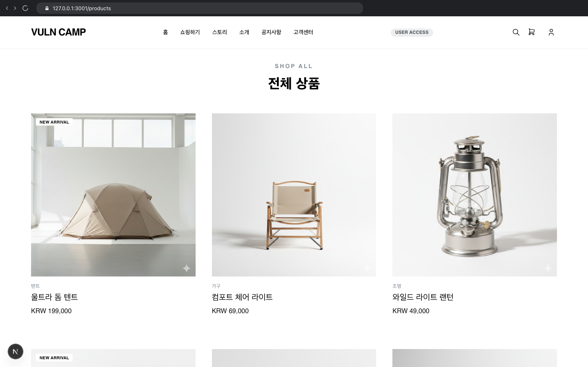
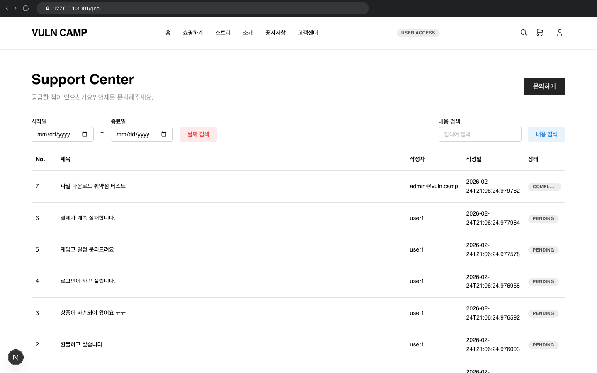
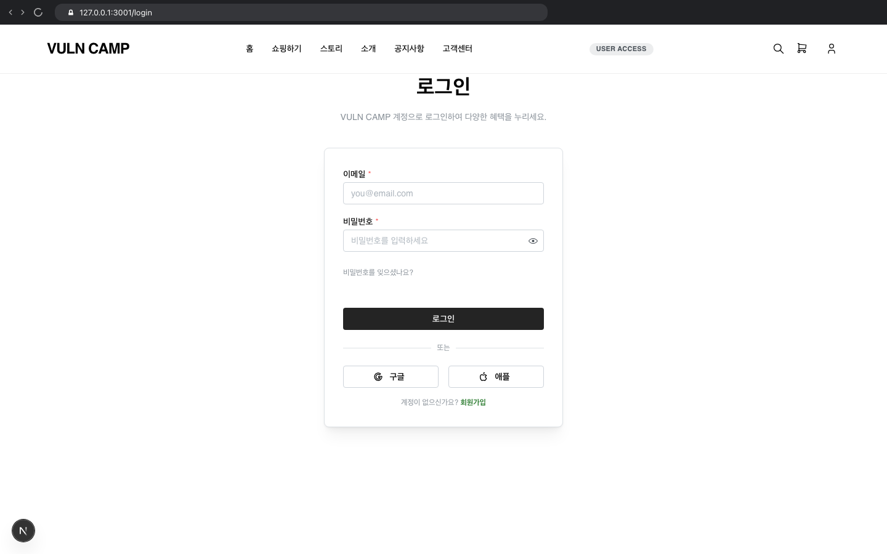
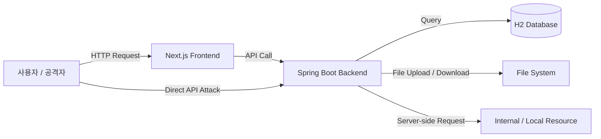

# Vuln Camp - 웹 취약점 실습 플랫폼


---

웹 보안을 공부하면서 느낀 건, 이론만으로는 한계가 있다는 거였습니다. 그래서 직접 웹 서비스를 개발하고, 그 안에 실제 취약점을 구현해보자는 생각으로 시작한 프로젝트입니다.

Vuln Camp는 단순한 데모 앱이 아니라 실제 서비스처럼 백엔드와 프론트엔드를 붙여놓은 구조 위에서 어떤 코드가 어떤 취약점으로 이어지는지 직접 확인하고, 공격 방법과 대응 방법을 함께 분석할 수 있도록 구성한 웹 취약점 실습 플랫폼입니다.

> 본 프로젝트는 교육 및 실습 목적의 취약한 애플리케이션입니다. 허가받지 않은 시스템에 공격 내용을 적용하는 것은 불법입니다.

---

## 서비스 소개

Vuln Camp는 캠핑 쇼핑몰 형태의 웹 서비스입니다. 상품 조회, 장바구니, 주문 및 결제, 쿠폰, 고객센터(QnA), 공지사항, 마이페이지 기능을 제공하며, 각 기능 곳곳에 웹 취약점 진단 시나리오가 포함되어 있습니다.

### 서비스 화면 미리보기

**1. 메인 홈페이지 (`/`)**<br>


<br>

**2. 상품 및 쇼핑 페이지 (`/products`)**<br>


<br>

**3. 고객센터(QnA) 게시판 (`/qna`)**<br>


<br>

**4. 로그인 및 권한 관리 (`/login`)**<br>


---

## 주요 기능

- 상품 목록 및 상세 조회
- 장바구니 및 주문서 작성
- 결제 금액 처리 및 쿠폰 적용
- 고객센터(QnA) 게시글 작성, 조회, 첨부파일 업로드 및 다운로드
- 공지사항 조회 및 관리자 작성 기능
- 마이페이지 및 비밀번호 변경
- 취약점 실습용 디버그 API
- CSRF 공격 검증용 PoC 페이지

---

## 기술 스택

| 영역 | 기술 | 설명 |
|---|---|---|
| Backend | Java 17, Spring Boot 2.7.5, Spring Data JPA | REST API 서버 및 취약한 비즈니스 로직 구현 |
| Frontend | Next.js 16, React 19, TypeScript, Mantine UI | 사용자 인터페이스 및 클라이언트 측 취약점 구현 |
| Database | H2 In-Memory DB | 별도 DB 설치 없이 실행 가능한 실습용 데이터베이스 |
| Build | Maven, npm | 백엔드 및 프론트엔드 빌드 관리 |
| Runtime | Docker, Docker Compose | 컨테이너 기반 실행 환경 |

---

## 아키텍처



프론트엔드는 사용자 화면과 클라이언트 측 로직을 담당하고, 백엔드는 REST API와 파일 처리, 인증 및 권한 처리, 비즈니스 로직을 담당합니다. 취약점 실습은 정상 사용자 흐름과 직접 API 요청 흐름을 모두 확인할 수 있도록 구성되어 있습니다.

---

## 진단 결과 요약

보고서 기준 Vuln-Camp 웹 애플리케이션을 대상으로 총 11건의 보안 취약점 진단을 수행하였으며, 위험도 기준으로 상 5건, 중 5건, 하 1건의 취약점을 확인하였음.

| 위험도 | 건수 |
|---|---:|
| 상 | 5 |
| 중 | 5 |
| 하 | 1 |
| 합계 | 11 |

---

## 확인된 취약점

| 번호 | 취약점 명 | 확인된 보안 위협 | 위험도 |
|---:|---|---|:---:|
| 1 | [IW-03] SQL Injection | 검색 파라미터 조작을 통해 DB 질의 변조 및 데이터 추출 가능 | 상 |
| 2 | [IW-11] Server-Side Request Forgery (SSRF) | 사용자 입력 URL을 서버가 요청하여 내부망 및 로컬 리소스 접근 가능 | 상 |
| 3 | [IW-12] 파일 업로드 | 확장자 및 콘텐츠 검증 미흡으로 악성 파일 업로드 및 실행 가능 | 상 |
| 4 | [IW-13] 파일 다운로드 | 파일명 파라미터 조작으로 서버 내 임의 파일 다운로드 가능 | 상 |
| 5 | [IW-14] 프로세스 검증 누락 | 결제 금액 등 주요 파라미터를 클라이언트에서 조작하여 비정상 처리 가능 | 중 |
| 6 | [IW-14] 프로세스 검증 누락 | 쿠폰 생성·검증 로직이 클라이언트에 노출되어 할인 정책 우회 가능 | 중 |
| 7 | [IW-16] 불충분한 인가 | 쿠키 값 변조를 통해 관리자 권한 획득 후 공지사항 작성 가능 | 중 |
| 8 | [IW-17] Cross Site Scripting (XSS) | QnA 게시글 입력값 검증 미흡으로 스크립트 삽입 및 사용자 세션 탈취 가능 | 중 |
| 9 | [IW-18] Cross Site Request Forgery (CSRF) | CSRF 토큰 검증 미흡으로 사용자 의도와 무관한 비밀번호 변경 요청 가능 | 상 |
| 10 | [IW-24] 정보 누출 | HTML 주석 및 디렉토리 리스팅을 통한 관리자 경로와 서버 파일 목록 노출 | 중 |
| 11 | [IW-25] 서버 정보 노출 | 디버그 API를 통해 서버 내부 소스코드 및 구현 정보 확인 가능 | 하 |

---

## 구현된 실습 시나리오

원격 저장소 기준 취약점 분석 문서는 `vulnerabilities/` 폴더에 정리되어 있으며, 주요 실습 시나리오는 다음과 같습니다.

### Injection

| 취약점 | 설명 |
|---|---|
| Blind SQL Injection | `PreparedStatement` 없이 문자열 직접 연결로 QnA 날짜 검색 조건 변조 가능 |
| Stored XSS | 불완전한 입력값 필터링과 HTML 렌더링으로 스크립트 실행 가능 |

### Broken Auth & Access Control

| 취약점 | 설명 |
|---|---|
| Broken Authentication | `VULN_ROLE` 쿠키에 권한을 평문 저장하여 권한 변조 가능 |
| IDOR | 리소스 소유권 검증 미흡으로 타 사용자 리소스 접근 가능 |
| Insufficient Authorization | 관리자 기능에 대한 서버 측 권한 검증 미흡 |

### File & Server Side

| 취약점 | 설명 |
|---|---|
| File Download | `filename` 파라미터 조작으로 서버 내부 파일 다운로드 가능 |
| File Upload | 확장자 검증 없이 JSP 등 서버 측 실행 파일 업로드 가능 |
| SSRF | 사용자 입력 URL을 서버가 직접 요청하여 내부 리소스 접근 가능 |
| Source Code Disclosure | 디버그 API를 통해 서버 내부 소스코드 조회 가능 |

### Business Logic & Client Side

| 취약점 | 설명 |
|---|---|
| Parameter Tampering | 결제 금액을 클라이언트에서 변조하여 서버로 전송 가능 |
| Insecure Client-Side Logic | 쿠폰 생성 및 검증 로직이 클라이언트 JavaScript에 노출 |
| CSRF | 비밀번호 변경 시 CSRF 토큰 및 기존 비밀번호 검증 미흡 |
| Information Leakage | HTML 주석, 디렉토리 리스팅 등을 통한 불필요한 정보 노출 |

---

## 프로젝트 구조

```text
Vuln-Camp-main/
├─ frontend/              # Next.js 프론트엔드
│  ├─ app/                # 페이지 라우트
│  ├─ components/         # UI 컴포넌트
│  ├─ context/            # 인증/장바구니 컨텍스트
│  └─ public/             # 정적 파일 및 CSRF PoC
├─ web/                   # Spring Boot 백엔드
│  ├─ src/main/java/      # 컨트롤러, 모델, 저장소, 설정
│  └─ uploads/            # 업로드 파일 저장 경로
├─ img/                   # README 및 취약점 문서 이미지
├─ vulnerabilities/       # 취약점별 분석 문서
├─ Portfolio/             # 포트폴리오 관련 산출물
├─ docker-compose.yml     # Docker Compose 실행 구성
├─ 취약점.md              # 취약점 분석 가이드
├─ 코드소개.md            # 코드 구조 소개 문서
├─ 보고서.docx            # 모의해킹 결과 보고서
└─ README.md
```

---

## Docker로 실행하기

Docker Desktop이 설치되어 있다면 프로젝트 루트에서 다음 명령으로 실행할 수 있습니다.

```bash
docker compose up --build
```

접속 주소:

```text
Frontend: http://localhost:3001
Backend:  http://localhost:8080
```

중지:

```bash
docker compose down
```

---

## 로컬에서 직접 실행하기

### 백엔드 실행

```bash
cd web
mvn spring-boot:run
```

백엔드 기본 주소:

```text
http://localhost:8080
```

### 프론트엔드 실행

```bash
cd frontend
npm install
npm run dev
```

프론트엔드 기본 주소:

```text
http://127.0.0.1:3001
```

Windows PowerShell에서 `npm.ps1` 실행 정책 오류가 발생하면 다음 명령을 사용할 수 있습니다.

```bash
npm.cmd run dev
```

---

## 주요 실습 엔드포인트

| 구분 | 경로 |
|---|---|
| QnA 날짜 검색 | `/api/qna/search?startDate=...&endDate=...` |
| SSRF 요청 | `/api/ssrf/fetch?url=...` |
| 파일 다운로드 | `/api/qna/download?filename=...` |
| 업로드 파일 접근 | `/uploads/qna/{filename}` |
| 서버 소스코드 조회 | `/api/debug/source?file=...` |
| 비밀번호 변경 | `/api/user/change-password` |
| CSRF PoC | `/csrf_change_password.html` |

---

## 테스트용 쿠키

일부 실습 기능은 브라우저 쿠키 값을 기반으로 동작합니다.

| 쿠키 | 설명 |
|---|---|
| `VULN_USER` | 현재 사용자 식별 값 |
| `VULN_ROLE` | 사용자 권한 값 |

관리자 권한 변조 실습 예시:

```js
document.cookie = 'VULN_ROLE=admin; path=/'
```

CSRF 실습 예시:

```js
document.cookie = 'VULN_USER=test@test.com; path=/'
```

---

## 관련 문서

- [취약점 분석 가이드](./취약점.md)
- [코드 구조 소개](./코드소개.md)
- [취약점별 상세 문서](./vulnerabilities)
- `보고서.docx` - Vuln-Camp 웹 애플리케이션 모의해킹 결과 보고서

---

## 주의사항

본 프로젝트는 의도적으로 취약하게 구현되어 있습니다.

- 외부 서비스나 허가받지 않은 시스템에 공격 기법을 적용하지 마세요.
- 실습 환경은 로컬 또는 격리된 네트워크에서만 실행하세요.
- 업로드 파일, 쿠키 변조, CSRF PoC 등은 교육 목적의 검증 범위 안에서만 사용하세요.
